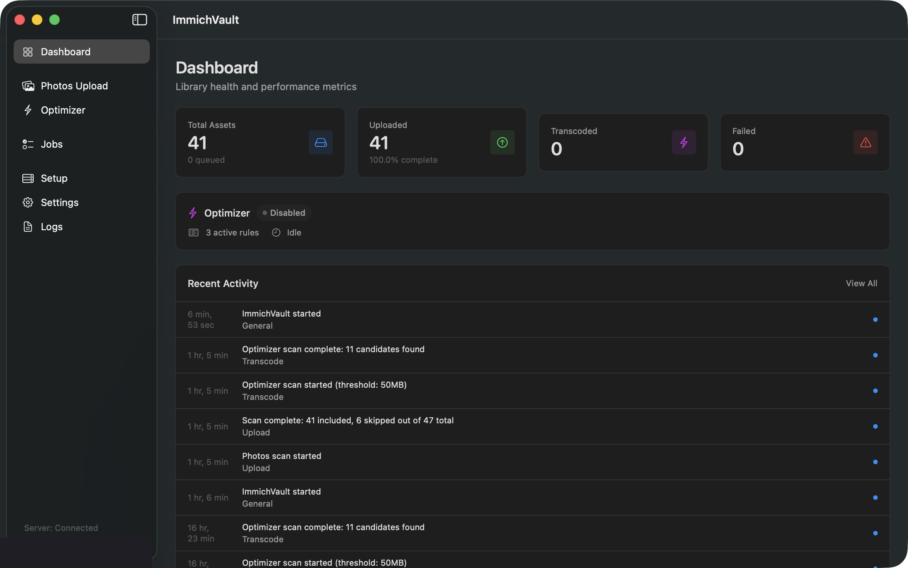
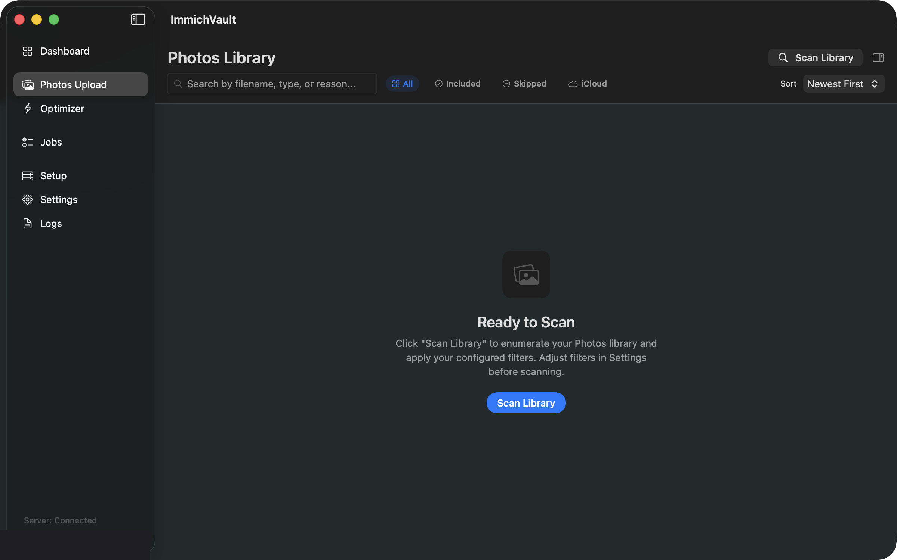
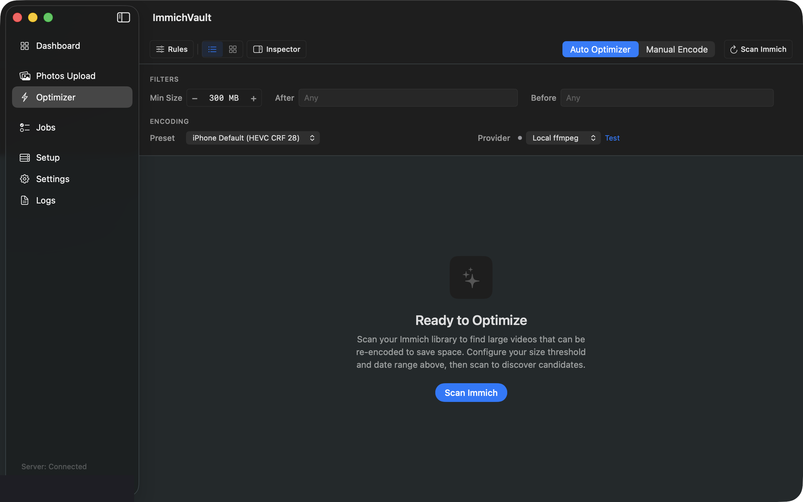
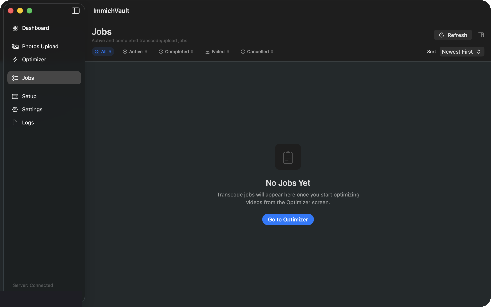
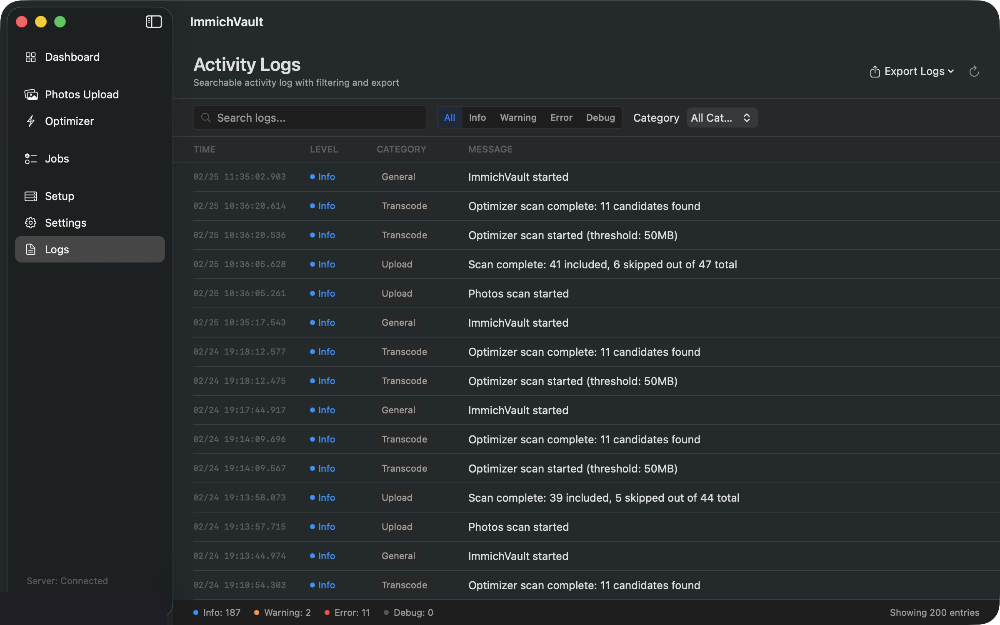
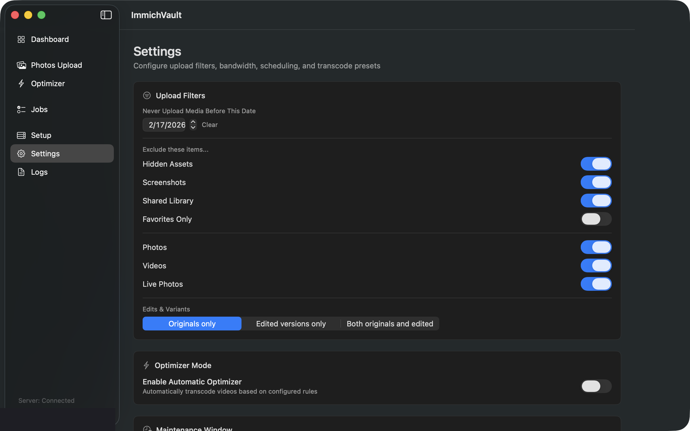

<p align="center">
  
</p>

<h1 align="center">ImmichVault</h1>

<p align="center">
  <strong>The ultimate macOS companion for <a href="https://immich.app">Immich</a></strong><br>
  Upload your entire Photos library. Optimize oversized videos. Save terabytes of storage.
</p>

<p align="center">
  
  
  
  
</p>

---

## What is ImmichVault?

ImmichVault is a native macOS app that bridges your Apple Photos library and your self-hosted [Immich](https://immich.app) server. It handles two major workflows that Immich doesn't offer natively:

1. **Photos Library Upload** — Scan your macOS Photos library, apply smart filters, and upload everything to Immich with bulletproof duplicate prevention.
2. **Video Optimization** — Find oversized videos on your Immich server, transcode them to save disk space, and seamlessly replace the originals — with full metadata preservation.

Built with SwiftUI and designed to feel like a first-party macOS app.

<p align="center">
  
</p>

---

## Features

### Photos Library Upload

Upload your entire Apple Photos library to Immich with intelligent duplicate detection and never-reupload guarantees.

<p align="center">
  
</p>

- **Smart Scanning** — Connects to your macOS Photos library via PhotoKit and enumerates all assets
- **Never Re-Upload** — Local SQLite database tracks every asset by `PHAsset.localIdentifier`. Once uploaded, an asset is never uploaded again — even if deleted from Immich
- **Configurable Filters** — Start date, album include/exclude, hide screenshots, exclude shared library, favorites only, media type toggles (photos/videos/Live Photos)
- **Edits & Variants** — Choose to upload originals only, edited versions only, or both
- **iCloud Awareness** — Detects iCloud placeholders and shows which assets need downloading
- **Idempotent Uploads** — Client-generated idempotency keys prevent duplicates even if the network drops mid-upload
- **Explain Why Skipped** — Every skipped asset shows an exact breakdown of which filter rules excluded it
- **Force Re-Upload** — Override duplicate protection for specific assets with confirmation and audit logging
- **Upload State Machine** — Each asset progresses through explicit states: idle → hashing → uploading → verifying → done, with retry and backoff for failures

### Video Optimizer

Find oversized videos on your Immich server and transcode them to dramatically reduce storage usage while preserving quality.

<p align="center">
  
</p>

- **Candidate Discovery** — Scans your Immich library for videos exceeding a size threshold within a date range
- **Review Before Action** — Preview every video that will be transcoded: file size, codec, resolution, bitrate, duration, estimated output size
- **Transcoding Presets** — Built-in presets for common scenarios (iPhone, GoPro, Screen Recording) plus fully custom codec/CRF/resolution/speed settings
- **Local ffmpeg** — Bundled ffmpeg/ffprobe binaries for zero-dependency local transcoding
- **Cloud Providers** — Plug-in support for CloudConvert, Convertio, and FreeConvert with cost tracking
- **Metadata Preservation** — Three-layer metadata pipeline ensures GPS coordinates, creation dates, camera make/model, lens info, and rotation survive transcoding
- **Safe Replacement** — Transcoded videos replace originals on Immich via the `replaceAsset` API only after passing strict metadata validation
- **Manual Encode** — Paste any Immich asset ID or URL to transcode a single video with custom settings
- **Inspector Panel** — Detailed side panel showing full asset metadata, codec info, and encoding details

### Rules Engine

Define automatic optimization rules that match videos by size, date range, album, and more.

- **Preset Rule Packs** — iPhone Default, GoPro, Screen Recording presets ship out of the box
- **Custom Rules** — Build rules combining size thresholds, date ranges, codec targets, and CRF values
- **Optimizer Mode** — Continuously scans for oversized videos and queues optimization within configurable maintenance windows

### Jobs & Monitoring

<p align="center">
  
</p>

- **Real-Time Progress** — Live progress bars with speed and ETA for active transcode jobs
- **Filter & Sort** — View jobs by status (active, completed, failed, cancelled) with multiple sort options
- **Retry & Cancel** — One-click retry for failed jobs or cancel active ones
- **Space Savings** — Track total storage saved across all completed optimizations
- **Clear Finished** — One-click cleanup of completed and cancelled jobs

### Activity Log

<p align="center">
  
</p>

- **Searchable Logs** — Full-text search across all activity with level and category filters
- **Export** — Export logs as JSON or CSV for external analysis
- **Secret Redaction** — API keys and sensitive data are automatically redacted from all log entries

### Settings

<p align="center">
  
</p>

- **Upload Filters** — Configure start date, album rules, media types, and edit preferences
- **Optimizer Mode** — Enable automatic transcoding with configurable maintenance windows
- **Safety Rails** — Configurable concurrency limits, bandwidth caps, and scheduling
- **Rate Limiting** — Per-provider rate limits and daily/weekly/monthly cost caps for cloud transcoding

### Dashboard

At-a-glance overview of your ImmichVault activity:

- Connection status and server health
- Queued, uploaded, optimized, and failed asset counts
- Optimizer status with active rule count
- Recent activity timeline with direct links to details

### Security

- **Keychain Storage** — All API keys stored securely in the macOS Keychain (never plaintext)
- **Database Portability** — Export/import your database snapshot to migrate between Macs
- **No App Sandbox** — Full Photos library access without sandbox restrictions

---

## Installation

### Download

Grab the latest DMG from the [Releases](https://github.com/bytePatrol/ImmichVault/releases) page.

1. Open `ImmichVault.dmg`
2. Drag **ImmichVault** to your **Applications** folder
3. Launch and configure your Immich server URL + API key

### Build from Source

**Requirements:**
- macOS 13+ (Ventura)
- Xcode 15+ with Swift 6.0
- [XcodeGen](https://github.com/yonaskolb/XcodeGen) (`brew install xcodegen`)
- ffmpeg/ffprobe binaries (auto-downloaded by the build script)

```bash
# Clone the repository
git clone https://github.com/bytePatrol/ImmichVault.git
cd ImmichVault

# Build release
./scripts/build_release.sh

# Package DMG
brew install create-dmg   # if not already installed
./scripts/package_dmg.sh

# Output: dist/ImmichVault.dmg
```

### Run Tests

```bash
xcodegen generate
xcodebuild -project ImmichVault.xcodeproj -scheme ImmichVault test
```

---

## Architecture

```
ImmichVault/
├── ImmichVault/                    # App target
│   ├── App/                        # SwiftUI App entry point
│   ├── Views/                      # All SwiftUI views
│   ├── ViewModels/                 # ObservableObject view models
│   └── Resources/                  # Assets, Binaries (ffmpeg/ffprobe)
├── Sources/
│   ├── Core/                       # Database, state machines, orchestrator, scheduling
│   ├── ImmichClient/               # Immich API client (upload, replace, search, download)
│   ├── PhotosScanner/              # PhotoKit integration and asset enumeration
│   ├── TranscodeEngine/            # Local ffmpeg + cloud provider implementations
│   └── MetadataEngine/             # Metadata extraction, validation, and application
├── Tests/
│   ├── CoreTests/                  # Database, state machine, logging tests
│   ├── ImmichClientTests/          # API client mock tests
│   └── TranscodeEngineTests/       # Transcode, metadata, preset tests
└── scripts/
    ├── build_release.sh            # Release build script
    ├── package_dmg.sh              # DMG packaging script
    └── download_ffmpeg.sh          # ffmpeg binary downloader
```

**Key design decisions:**
- **Single Xcode target** compiled as module `ImmichVault`, generated via XcodeGen from `project.yml`
- **GRDB.swift** for SQLite — type-safe, migration-friendly, battle-tested
- **Separate TranscodeJob table** from AssetRecord for clean lifecycle separation
- **Metadata validation is a hard gate** — `replaceAsset` is never called if validation fails
- **GPS validation is critical severity** — replacement blocked if GPS coordinates are lost

---

## Metadata Preservation

ImmichVault uses a multi-layer metadata pipeline to ensure nothing is lost during transcoding:

1. **ffprobe extraction** — Reads format-level and stream-level metadata from the source
2. **exiftool enrichment** — Extracts camera-specific tags that ffprobe misses (lens model, focal length, QuickTime GPS atoms)
3. **Immich API fallback** — For files with no embedded GPS (e.g., Google-produced MP4s), retrieves coordinates from Immich's database
4. **ffmpeg injection** — Remuxes transcoded streams with source metadata via `-map_metadata` plus explicit GPS (ISO 6709), make/model, and lens model tags
5. **exiftool post-processing** — Copies QuickTime Keys, UserData, XMP, and ItemList groups from source, then writes GPS coordinates in ISO 6709 format
6. **Strict validation** — Compares source and output metadata. Any critical mismatch (duration, resolution, GPS loss) blocks replacement

**Preserved metadata includes:** creation date, GPS coordinates, camera make/model, lens model, focal length, rotation/orientation, timezone offsets, and QuickTime vendor tags.

---

## Immich API Usage

ImmichVault uses the following Immich API endpoints:

| Endpoint | Purpose |
|----------|---------|
| `GET /api/server/info` | Connection test and server version |
| `GET /api/users/me` | Authenticated user info |
| `POST /api/assets` | Upload new assets (multipart) |
| `PUT /api/assets/{id}/original` | Replace asset with transcoded version |
| `POST /api/search/metadata` | Search for video candidates |
| `GET /api/assets/{id}` | Fetch asset details (exif, GPS, dates) |
| `GET /api/assets/{id}/original` | Download original file for transcoding |

Authentication uses the `x-api-key` header with a key stored in your macOS Keychain.

---

## Configuration

| Setting | Description | Default |
|---------|-------------|---------|
| Immich Server URL | Your Immich instance URL | — |
| API Key | Immich API key (stored in Keychain) | — |
| Start Date | Ignore all media before this date | None |
| Max Concurrent Uploads | Parallel upload limit | 3 |
| Max Concurrent Transcodes | Parallel transcode limit | 2 |
| Bandwidth Cap | Upload speed limit (MB/s) | Unlimited |
| Maintenance Window | Time range for optimizer runs | 24/7 |
| Min Video Size | Minimum file size for optimization candidates | 100 MB |

---

## Requirements

- **macOS 13+** (Ventura or later)
- **Immich server** v1.90+ with API access
- **Photos library access** permission (requested on first launch)
- **~200MB disk space** for the app bundle (includes ffmpeg/ffprobe)

---

## Known Limitations

- Photos library scanning requires the app to have Full Disk Access or Photos permission
- iCloud placeholder downloads require the Photos app to be running
- Cloud transcoding providers (CloudConvert, Convertio, FreeConvert) require separate API keys and accounts
- Local ffmpeg transcoding speed depends on your Mac's CPU — Apple Silicon recommended
- The app must be running for the optimizer scheduler to process jobs (no background daemon)

---

## License

This project is licensed under the MIT License. See [LICENSE](LICENSE) for details.

---

<p align="center">
  <sub>Built for the <a href="https://immich.app">Immich</a> community</sub>
</p>
